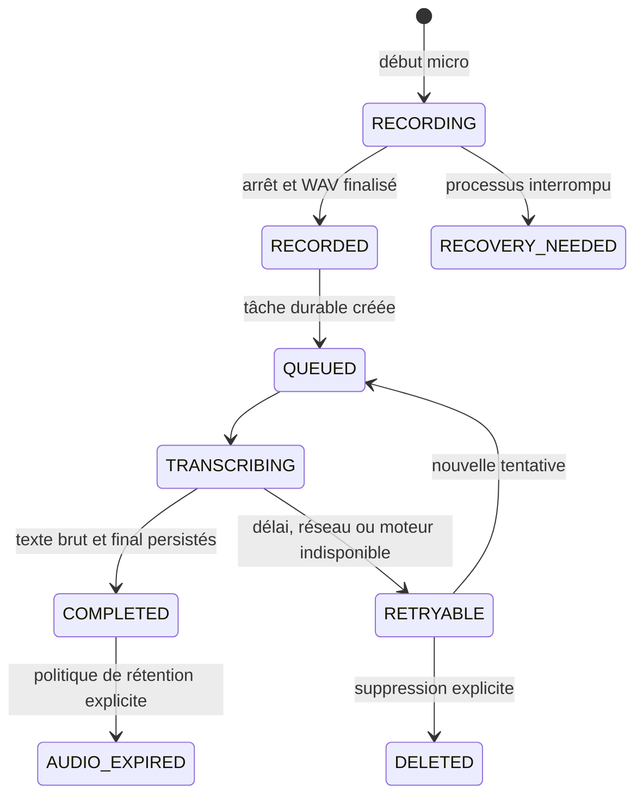

# Stabilisation Android et feuille de route produit

## Statut du document

- **Portée :** application Android Chuchote Flow.
- **Point de départ audité :** branche `main`, commit `552c4282595922f5a7f1eeb5c6140c4b24f9dfbf`.
- **Origine des besoins :** retour d'utilisation d'Olivier du 22 août 2026.
- **Nature :** diagnostic, décisions, critères d'acceptation et état d'implémentation du worktree.
- **Preuve sur appareil :** Samsung SM-S721W, Android 16/API 36, application `9-debug`, observé par ADB le 23 août 2026.
- **État au 23 août :** lots B et une partie du lot C sont implémentés. Le gel
  courant passe 159 scénarios unitaires dans 34 suites/fichiers, Android Lint et
  `assembleQa`; un APK `9-qa` signé debug est construit. La migration SQLite
  avait déjà passé son test instrumenté sur appareil. La validation humaine des
  longues dictées, du pont microphone Android 14+, des deux dictées consécutives
  et de Gmail/ChatGPT/Claude reste ouverte.

### Avancement vérifié du worktree

- **Lot A — preuves :** terminé pour les OOM/CME, le délai destructif et le service d'accessibilité non lié; voir `BUGS_HISTORY.md`.
- **Lot B — zéro perte :** implémenté (WAV progressif récupérable, SQLite v3, états durables, reprise, bouton Réessayer, segments de 30 secondes, pipeline séquentiel).
- **Lot C — insertion/orbe :** implémenté en partie (cible élargie puis liée
  strictement au champ de départ, erreurs explicites, état lié distinct de l'état
  coché, position persistante, lanceur au focus, vérification texte+curseur,
  générations par tentative et rejet des callbacks tardifs). Matrice multi-apps
  encore à valider.
- **Lot D — apprentissage :** prototype prudent seulement. Une fenêtre bornée peut proposer une correction, mais le compteur de répétitions, les règles contextuelles et l'automatisation réversible ne sont pas livrés.
- **Lots E et F :** non commencés dans ce correctif; ils restent décrits ci-dessous et ne doivent pas être présentés comme livrés.

## Résultat produit recherché

Chuchote doit devenir une mémoire de dictée fiable, commune à l'ordinateur et au téléphone. Sur Android, cela exige d'abord qu'aucune dictée ne soit perdue, puis que l'insertion fonctionne dans les principaux champs texte, avant d'automatiser l'apprentissage, les statistiques et la synchronisation.

Ordre de priorité retenu :

1. conserver l'audio et rendre toute transcription récupérable;
2. fiabiliser l'insertion dans Gmail, ChatGPT, Claude et les champs Android courants;
3. faire apparaître automatiquement l'orbe sur un champ texte, avec une position persistante;
4. apprendre des corrections répétées sans remplacement ambigu ou irréversible;
5. stocker les mesures nécessaires et afficher des statistiques utiles;
6. moderniser les paramètres et ajouter la personnalisation visuelle;
7. synchroniser l'historique et le dictionnaire avec le produit ordinateur.

Cette séquence est intentionnelle : les statistiques et l'apprentissage ne peuvent pas être fiables si l'audio, le texte brut, la correction finale et le résultat d'insertion ne sont pas d'abord persistés.

## 1. Insertion par accessibilité

### Symptôme utilisateur

- Gmail reçoit correctement la transcription dans le champ actif.
- ChatGPT et Claude ne la reçoivent pas.
- Dans ces deux applications, Chuchote utilise le presse-papiers comme repli.
- La désinstallation d'une autre application d'accessibilité n'a pas corrigé le problème.

### Comportement du point de départ confirmé

Dans la version `9-debug` observée, le service cherche un nœud avec `findFocus(FOCUS_INPUT)`, puis refuse le candidat si `isEditable` n'est pas vrai. Il tente ensuite `ACTION_PASTE`, puis `ACTION_SET_TEXT`. Si aucun nœud ne passe ce filtre ou si les deux actions échouent, le widget copie le texte dans le presse-papiers.

Références :

- [`TextInsertionAccessibilityService.kt`](../app/src/main/kotlin/dev/soupslurpr/transcribro/overlay/TextInsertionAccessibilityService.kt)
- [`FloatingWidgetService.kt`](../app/src/main/kotlin/dev/soupslurpr/transcribro/overlay/FloatingWidgetService.kt)
- [`accessibility_service_config.xml`](../app/src/main/res/xml/accessibility_service_config.xml)

Cette version reçoit des événements de focalisation, mais ne les utilise pas.
Le worktree de remédiation les traite désormais pour rappeler une instance
existante du widget et élargit la recherche du champ à toutes les fenêtres
interactives avec un parcours borné.

### Preuve sur appareil du 23 août 2026

L'inspection ADB a trouvé une cause immédiate supplémentaire : le service Chuchote était encore **activé** dans les paramètres Android, mais figurait dans `Crashed services` et n'était initialement plus lié comme service actif. Dans cet état, le singleton `TextInsertionAccessibilityService.instance` est absent et `insertText()` retourne directement `false`; le widget utilise alors le presse-papiers.

Après désactivation puis réactivation manuelle du service d'accessibilité :

- Android l'a de nouveau lié;
- le service du widget flottant a démarré en premier plan;
- la fenêtre `APPLICATION_OVERLAY` de l'orbe était présente et rendue;
- Olivier a confirmé que Chuchote fonctionnait de nouveau.

Ce rétablissement de la version `9-debug` est une récupération opérationnelle,
pas un correctif de cette version. Le worktree supprime les causes OOM/CME
observées et rend l'état « coché mais non lié » explicite; la non-récidive doit
encore être confirmée pendant les essais QA de longue durée.

Le champ ChatGPT observé était exposé comme un `android.widget.EditText`, focalisable, activé et non sensible. Cette observation réduit la probabilité d'une incompatibilité fondamentale avec ChatGPT dans le scénario actuel, mais les actions `AccessibilityNodeInfo` disponibles n'ont pas encore été instrumentées dans Chuchote. Le filtre `isEditable` demeure donc une hypothèse secondaire à couvrir par test, pas une cause définitivement fermée.

### Hypothèses à départager sur appareil

1. **Nœud personnalisé :** le champ ChatGPT ou Claude est exposé par Compose, WebView ou une vue personnalisée; le nœud focalisé accepte une action d'édition sans déclarer `isEditable`.
2. **Mauvais niveau dans l'arbre :** le focus se trouve sur un enfant, alors que l'action `SET_TEXT` ou `PASTE` appartient à un parent ou à un descendant.
3. **Nœud périmé ou action différée :** la référence obtenue immédiatement après le changement de focus est déjà périmée, ou l'application cible refuse momentanément l'action.

Ces hypothèses doivent être testées dans cet ordre; aucune ne doit être déclarée cause racine avant une trace reproduite.

### Instrumentation minimale, sans journaliser le texte

Pour chaque tentative d'insertion, le diagnostic doit enregistrer uniquement :

- l'application cible et la classe du nœud;
- la stratégie de découverte utilisée;
- `isFocused`, `isEditable`, `isEnabled` et `isPassword`;
- la liste des identifiants d'actions disponibles;
- le résultat de `PASTE`, de `SET_TEXT` et de la vérification;
- l'âge du dernier événement de focus et l'identifiant de fenêtre.

Le contenu du champ et la transcription ne doivent jamais être écrits dans Logcat.

### Correctif implémenté dans le worktree

La recherche de cible est maintenant progressive :

1. focus d'entrée global du service;
2. focus dans les fenêtres interactives hors Chuchote;
3. parcours borné des descendants à la recherche d'un nœud focalisé et activé
   qui annonce `ACTION_SET_TEXT` ou `ACTION_PASTE`;
4. capture de l'identité logique par package, fenêtre valide et `uniqueId`,
   sinon égalité de source du nœud; `viewIdResourceName` ne constitue jamais à
   lui seul une preuve positive;
5. composition puis `ACTION_SET_TEXT` en préservant le curseur ou la sélection;
6. résultat typé et repli presse-papiers seulement si la cible capturée reste
   prouvée, accompagné d'une explication exacte.

Un nœud mot de passe ou sensible est exclu de la capture, de l'insertion et de
l'observation des corrections.

### Critères d'acceptation

- Une dictée courte est insérée au curseur dans Gmail, ChatGPT et Claude.
- Le texte existant avant et après le curseur n'est pas supprimé.
- Un champ multi-ligne conserve ses retours de ligne.
- Un champ vide et un champ déjà rempli sont couverts.
- L'échec d'une action peut déclencher le repli presse-papiers et un message
  exact seulement si la cible reste prouvée; un changement de cible conserve le
  résultat dans l'historique sans copie implicite.
- Le service n'agit jamais dans sa propre fenêtre de superposition.
- Aucun contenu dicté ou lu n'apparaît dans les journaux.
- Un test de non-régression échoue si le filtre strict `isEditable` est
  réintroduit comme unique critère ou si un même champ réexposé avec une clé
  stable est rejeté.

## 2. Dictée longue, conservation audio et nouvelle tentative

### Symptôme utilisateur

Une dictée de plus de deux minutes a été transcrite très longtemps, puis abandonnée. Ni texte ni audio récupérable n'est resté dans l'application.

### Cause racine confirmée

Le widget arme un délai fixe de `120_000 ms` quand il passe à l'état de transcription. Si le résultat final n'est pas revenu à l'expiration :

1. `speechRecognizer.cancel()` est appelé;
2. l'interface retourne à l'état inactif;
3. le message « Transcription trop longue, dictée abandonnée » est affiché.

Le tampon PCM n'existe qu'en mémoire dans le service de reconnaissance. `cancel()` annule les tâches et aucun fichier audio n'est conservé. La durée de l'enregistrement et l'avancement réel ne participent pas au délai fixe.

### Crashs confirmés sur l'appareil

Le journal de crash Android montre que le délai fixe n'est pas le seul mécanisme de perte :

- plusieurs `OutOfMemoryError` ont atteint la limite de tas de 256 Mio pendant l'accumulation dans `ArrayList`, la copie par `slice(...).toList()` et le traitement VAD;
- une allocation de tranche audio d'environ 43,9 Mo a échoué;
- plusieurs crashs sont survenus pendant `audioData.add(...)`, ce qui confirme le coût d'une liste de `Short` encadrés et sans limite;
- des `ConcurrentModificationException` ont été levées pendant l'itération de listes audio ou de `transcribeJobs` modifiées par d'autres coroutines;
- le crash le plus récent observé date du 22 août 2026 à 22:22:46 et se produit dans le parcours de fin/jointure de `onStartListening`.

Dans la version `9-debug` auditée, le code lançait une coroutine VAD pour chaque tampon lu, tout en partageant sans sérialisation `transcriptions`, `transcriptionIndex`, les listes audio et `transcribeJobs`. Les tâches de transcription itéraient également `transcribeJobs` pendant que d'autres tâches y ajoutaient des éléments. Les traces de l'appareil ont transformé les risques de mémoire et de concurrence relevés statiquement en causes racines reproduites; le worktree les remplace par un pipeline séquentiel et borné.

Références :

- [`FloatingWidgetService.kt`](../app/src/main/kotlin/dev/soupslurpr/transcribro/overlay/FloatingWidgetService.kt)
- [`MainRecognitionService.kt`](../app/src/main/kotlin/dev/soupslurpr/transcribro/recognitionservice/MainRecognitionService.kt)

### Invariant à instaurer

> Dès que l'enregistrement commence, une dictée doit avoir une représentation durable. Une erreur, un arrêt du processus, une perte réseau ou un dépassement de temps peut retarder la transcription, mais ne doit pas supprimer l'audio récupérable.

### Modèle de cycle de vie proposé

### Changements de stockage nécessaires

Créer un enregistrement au début de la capture avec au minimum :

| Champ | Rôle |
|---|---|
| `id` | identifiant stable, réutilisable lors de la synchronisation |
| `created_at` | début de la dictée |
| `recording_ended_at` | fin de la capture |
| `audio_duration_ms` | durée servant à la progression et aux statistiques |
| `audio_path` | chemin interne privé du WAV ou du PCM finalisé |
| `audio_sha256` | contrôle d'intégrité facultatif mais recommandé |
| `state` | `recording`, `queued`, `transcribing`, `retryable`, `completed`, etc. |
| `attempt_count` | nombre d'essais de transcription |
| `last_error_code` | code stable, distinct d'un message traduit |
| `transcription_started_at` | début de la dernière tentative |
| `transcription_ended_at` | fin ou échec de la dernière tentative |
| `raw_text` | sortie avant dictionnaire |
| `final_text` | sortie après corrections acceptées |
| `engine` | moteur local ou relais distant |

Le fichier doit être écrit progressivement dans le stockage interne privé et finalisé de façon atomique. Un en-tête WAV incomplet doit pouvoir être réparé au prochain lancement à partir de la taille du PCM.

### Exécution durable

- La fin de l'enregistrement crée une tâche de transcription indépendante de l'orbe.
- Un travail long doit rester attaché à une notification de premier plan ou à une tâche Android durable compatible avec les restrictions de l'OS.
- Un délai ne supprime jamais l'audio. Il fait passer la tentative à `retryable` et explique l'état dans l'historique.
- L'utilisateur peut relancer localement ou par relais si les consentements correspondants sont actifs.
- Deux tentatives concurrentes pour la même dictée doivent être empêchées.
- Une réussite tardive doit être idempotente : elle ne crée pas deux entrées d'historique.

### Progression et couleurs

La candidate remplace la constante par un estimateur qui combine durée audio,
temps écoulé et nombre de segments terminés. La progression est monotone et
plafonnée avant le succès; le vert plein n'est déclenché que par le callback
terminal confirmé. Ce modèle doit encore être jugé visuellement sur des dictées
de 10 secondes, 2 minutes et 5 minutes.

Le modèle suit les règles suivantes :

- réserve rouge-orange pendant la préparation et le premier segment;
- progression segmentée selon `audio_processed_ms / audio_duration_ms` lorsque le moteur expose cette information;
- à défaut, estimation prudente basée sur la durée audio;
- jaune tant que le traitement est actif;
- vert uniquement lorsque le résultat est persisté;
- animation indéterminée distincte si l'estimation est dépassée, sans annoncer faussement une quasi-réussite.

### Critères d'acceptation

- Une dictée de 3, 5 et 10 minutes crée immédiatement une entrée récupérable.
- Forcer l'arrêt de l'application pendant l'enregistrement ou la transcription laisse un audio récupérable au prochain lancement.
- Une perte réseau produit un état `retryable`, sans perdre l'audio.
- Le bouton « Réessayer » ne crée ni doublon de texte ni tâche concurrente.
- Le dépassement de 120 secondes ne détruit rien et n'affiche plus « abandonnée ».
- Une transcription réussie conserve la durée, le moteur et la latence.
- Le vert final n'apparaît qu'après la persistance réussie du texte.
- Des tests de migration protègent les historiques existants.

### Politique de rétention à décider

Tant qu'une décision produit explicite n'est pas prise, la valeur sûre est :

- conserver sans limite automatique tout audio en échec ou en attente;
- conserver l'audio réussi jusqu'à suppression explicite;
- afficher l'espace occupé;
- offrir plus tard une règle configurable, par exemple suppression après 30 ou 90 jours seulement pour les transcriptions réussies et synchronisées.

## 3. Apparition automatique de l'orbe

### État du point de départ et remédiation

- Dans `9-debug`, l'événement `TYPE_VIEW_FOCUSED` est configuré mais ignoré,
  l'orbe est démarrée manuellement ou réveillée par secousse et sa position
  n'est pas persistée.
- Dans le worktree, le focus d'un champ compatible rappelle automatiquement
  une instance de widget déjà démarrée et la dernière position est persistée.
- Si aucune instance du widget n'existe, le service d'accessibilité affiche à
  la dernière position un petit lanceur sans microphone. Un tap explicite crée
  ensuite l'orbe principale; un second tap sur l'orbe démarre la capture. Cette
  séparation respecte les restrictions de démarrage et évite une capture
  clandestine. Le lanceur reste visible tant que l'attachement réel du widget
  n'a pas été confirmé.

### Comportement visé

Avec une préférence explicite « Afficher l'orbe dans les champs texte » :

1. le service observe un focus d'entrée compatible hors Chuchote;
2. il démarre ou réaffiche l'orbe;
3. l'orbe reprend sa dernière position enregistrée, ajustée si l'écran ou l'orientation a changé;
4. la sortie du champ ne déclenche pas immédiatement une disparition gênante;
5. un délai anti-rebond empêche les clignotements pendant la navigation.

### Garde-fous

- ignorer les fenêtres appartenant à Chuchote;
- ne lire aucun texte pour décider de l'affichage;
- ne pas afficher sur un contrôle non éditable;
- permettre de désactiver complètement l'automatisme;
- respecter les restrictions Android de démarrage d'un service de premier plan;
- persister `x`, `y`, orientation et dimensions de référence, puis borner la position à l'écran actuel.

### Critères d'acceptation

- Après redémarrage du téléphone, toucher un champ Gmail, ChatGPT ou Claude affiche l'orbe si l'option est active.
- Aucun geste de secousse n'est requis.
- La dernière position est restaurée en portrait et reste visible après rotation.
- Le clavier qui s'ouvre ne pousse pas l'orbe hors écran.
- L'option désactivée ne démarre aucun widget.

## 4. Dictionnaire apprenant et ambiguïtés contextuelles

### Limite actuelle confirmée

Le dictionnaire applique principalement une substitution exacte `entendu → remplacer_par`. Une règle ambiguë peut donc remplacer une forme correcte dans tous les contextes. L'observation des corrections est actuellement limitée au parcours du widget et exige une confirmation explicite.

### Principe de sécurité linguistique

Une correction répétée n'est pas automatiquement une règle universelle. Deux observations identiques doivent créer ou renforcer une **candidate**, puis le système choisit entre :

- **biais de reconnaissance :** favoriser un nom ou terme sans remplacement mécanique;
- **règle exacte :** remplacement déterministe pour une forme non ambiguë;
- **règle contextuelle :** appliquer seulement avec des indices voisins suffisants;
- **suggestion :** demander confirmation quand les indices sont insuffisants.

Ainsi, une forme acoustiquement proche d'un nom propre et d'un mot courant ne devient pas toujours le nom propre. Le contexte, l'application cible, les mots voisins et l'historique de confirmations servent à départager les sens.

### Données d'apprentissage proposées

| Entité | Données principales |
|---|---|
| observation | texte entendu, correction, contexte gauche/droite, application source, date |
| candidate | paire normalisée, nombre d'observations, confiance, dernière occurrence |
| règle | mode, seuil, contexte autorisé, statut actif/inactif |
| décision | acceptation, rejet, annulation, origine manuelle ou automatique |

Le texte complet du champ n'est pas nécessaire : une fenêtre locale bornée autour de la correction suffit. Les champs de mot de passe et applications exclues ne doivent produire aucune observation.

### Seuil initial proposé

- Première correction : observation seulement.
- Deuxième correction identique : candidate visible ou règle de biais non destructive.
- Automatisation : seulement après confirmations cohérentes et absence de rejets; jamais une substitution exacte automatique pour une paire marquée ambiguë.

Le seuil « deux fois » vient du besoin exprimé, mais il doit rester configurable et réversible.

### Critères d'acceptation

- Deux corrections identiques créent une candidate unique et incrémentent son compteur.
- Une ambiguïté nom propre/mot courant ne déclenche pas de remplacement universel.
- L'utilisateur peut voir pourquoi une correction a été proposée, l'accepter, la désactiver ou l'annuler.
- Les corrections du widget et des autres parcours autorisés alimentent le même modèle.
- Aucun champ sensible n'est observé.
- Les règles sont déterministes et testées sur ponctuation, casse, accents, limites de mots et expressions multi-mots.

## 5. Statistiques

### Mesures de base à persister

- nombre de mots bruts et finaux;
- durée audio;
- temps d'attente, temps de traitement et latence totale;
- moteur et mode local/distant;
- succès, échec, nouvelle tentative et repli presse-papiers;
- horodatage local avec fuseau enregistré;
- application cible sous forme d'identifiant facultatif et désactivable;
- nombre de corrections proposées, acceptées, rejetées et annulées.

### Vues proposées

1. mots aujourd'hui, cette semaine et ce mois;
2. tendance quotidienne et hebdomadaire;
3. carte de chaleur heure × jour de semaine, avec intensité liée à l'utilisation;
4. expressions récurrentes sous forme de groupes de 2 à 4 mots, calculées localement;
5. temps médian de transcription par 10 secondes d'audio, par moteur;
6. taux de réussite, d'échec, de nouvelle tentative et de repli presse-papiers;
7. vocabulaire appris et gain estimé des corrections acceptées.

La médiane et les percentiles sont préférables à la seule moyenne, car une dictée exceptionnellement longue fausserait la lecture.

### Confidentialité

- calcul local par défaut;
- option séparée pour les phrases récurrentes, puisqu'elles révèlent du contenu;
- possibilité de réinitialiser uniquement les statistiques sans supprimer l'historique;
- agrégats synchronisés seulement après consentement explicite;
- aucune télémétrie externe implicite.

## 6. Modernisation UI/UX et personnalisation

### Paramètres

La refonte doit regrouper les choix selon l'intention de l'utilisateur :

- **Dicter :** moteur, langue, comportement du widget;
- **Insérer :** accessibilité, apparition automatique, presse-papiers;
- **Apprendre :** dictionnaire, observations, applications exclues;
- **Données :** historique, audio, rétention, synchronisation;
- **Apparence :** orbe, onde, thème et aperçu;
- **Confidentialité :** données lues, données envoyées, consentements;
- **Diagnostic :** version, état des permissions et export de journaux expurgés.

Les états de permission doivent être actionnables : état actuel, raison, bouton système pertinent et test rapide.

### Couleurs

Les préférences visuelles doivent distinguer :

- couleur de repos de l'orbe;
- couleur de l'onde sinusoïdale;
- éventuellement couleur d'accent;
- gradient sémantique de traitement, qui reste rouge-orange → jaune → vert.

Un aperçu en direct et quelques palettes accessibles évitent de rendre l'orbe illisible. Le vert doit rester réservé à une réussite confirmée et le rouge à un état initial/attention; les couleurs personnalisées ne doivent pas contredire ces états.

## 7. Fondation de synchronisation ordinateur–Android

Cette phase vient après la fiabilité locale. Chaque dictée et chaque règle de vocabulaire doit recevoir un identifiant stable, un état de synchronisation, une date de modification et une stratégie de conflit.

Le premier contrat partagé devrait couvrir :

- historique des dictées;
- texte brut et final;
- métadonnées audio et état de transcription;
- fichier audio ou référence de stockage, selon la politique choisie;
- observations, candidates et règles de vocabulaire;
- suppressions propagées par tombstones;
- version de schéma et origine de la modification.

Neon peut être la base relationnelle commune, mais ce n'est pas un stockage audio. Les fichiers audio nécessitent un stockage objet privé et des URL temporaires, ou restent locaux avec une politique de synchronisation explicitement limitée.

## Plan de livraison recommandé

### Lot A — Preuves et diagnostics

- reproduire Gmail, ChatGPT et Claude sur l'appareil réel;
- capturer une trace d'accessibilité expurgée;
- reproduire une transcription dépassant 120 secondes;
- ajouter des tests sensibles aux causes observées.

**Sortie :** deux causes racines documentées, sans hypothèse restante présentée comme fait.

### Lot B — Zéro perte de dictée

- migration de données;
- capture audio progressive;
- états durables et reprise;
- historique avec Réessayer;
- progression longue proportionnelle;
- tests d'arrêt forcé, délai et idempotence.

**Sortie :** aucune dictée commencée ne disparaît silencieusement.

### Lot C — Insertion et orbe automatique

- découverte de cible compatible;
- vérification/repli sans double insertion;
- cache de focus borné;
- apparition automatique optionnelle;
- persistance de position;
- matrice d'essais multi-apps.

**Sortie :** Gmail, ChatGPT et Claude passent les scénarios d'insertion convenus.

### Lot D — Apprentissage prudent

- modèle observations/candidates/règles;
- seuil répétitif;
- règles contextuelles et ambiguïtés;
- panneau d'explication, annulation et exclusions;
- tests linguistiques.

**Sortie :** le dictionnaire apprend sans transformer une ambiguïté en remplacement global.

### Lot E — Mesures, statistiques et apparence

- instrumentation locale;
- agrégats et carte de chaleur;
- expressions récurrentes avec consentement;
- nouveaux paramètres et palettes;
- audit d'accessibilité visuelle.

**Sortie :** statistiques interprétables et paramètres modernisés sans régression des fonctions centrales.

### Lot F — Synchronisation

- contrat partagé avec l'application ordinateur;
- authentification et séparation des données;
- synchronisation idempotente;
- stockage audio privé;
- conflits, suppression et fonctionnement hors ligne.

**Sortie :** une dictée effectuée sur un appareil apparaît de façon fiable sur l'autre, avec provenance et état explicites.

## Matrice de validation minimale

| Domaine | Scénarios obligatoires |
|---|---|
| insertion | Gmail, ChatGPT, Claude; champ vide/rempli; curseur milieu/fin; multi-ligne |
| audio | 10 s, 2 min, 5 min, 10 min; silence; interruption; stockage presque plein |
| reprise | arrêt forcé, redémarrage téléphone, réseau coupé, relais lent, moteur local en échec |
| dictionnaire | règle exacte, biais, ambiguïté, casse, accent, ponctuation, expression |
| orbe | portrait, paysage, clavier ouvert, rotation, redémarrage, option désactivée |
| statistiques | changement de fuseau, journée vide, gros historique, suppression, nouvelle tentative |
| confidentialité | mot de passe, application exclue, journaux expurgés, consentement relais |

## Informations de reproduction encore nécessaires

Pour fermer le diagnostic d'accessibilité sur le téléphone réel :

- modèle du téléphone et version Android;
- version de Chuchote installée et origine de l'APK;
- version de ChatGPT et de Claude;
- confirmation du parcours utilisé : orbe flottante ou clavier Chuchote;
- message exact affiché lors du repli presse-papiers;
- trace expurgée produite avec une version diagnostique, idéalement via USB et ADB.

Ces informations ne bloquent pas la conception du stockage durable, mais elles sont nécessaires avant de prétendre corriger la compatibilité des champs ChatGPT et Claude.
