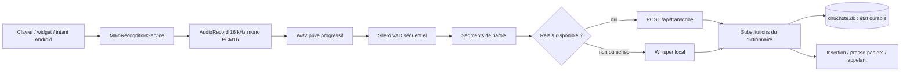

# Architecture Android actuelle

> **Type** : explication technique
> **Statut** : point de départ audité; candidate `codex/android-alpha` implémentée, preuve machine détaillée dans `BUILD_AND_VALIDATION.md`, validation appareil ouverte
> **Snapshot** : `Chuchote-flow-android@552c4282595922f5a7f1eeb5c6140c4b24f9dfbf`
> **Sources principales** : `app/src/main/`, `lib/src/main/`

## Vue d'ensemble

## Stack vérifiée

| Couche | Technologie |
|---|---|
| Langage | Kotlin 2.2, Java/JVM 17 |
| Interface | Jetpack Compose, Material 3, Navigation Compose |
| Préférences | Android DataStore et `SharedPreferences` |
| Base | `SQLiteOpenHelper` |
| VAD | Silero ONNX via ONNX Runtime Android |
| STT local | `whisper.cpp` via JNI/CMake |
| HTTP | `HttpURLConnection` |
| Modules Gradle | `:app` et `:lib` |

Paramètres de plateforme : minSdk 29, targetSdk 36, compileSdk 36, ABI `arm64-v8a` et `x86_64`. Références : [`app/build.gradle.kts`](../app/build.gradle.kts#L53-L86) et [`lib/build.gradle`](../lib/build.gradle).

## Surfaces de dictée

### Clavier vocal

`VoiceInput` est un `InputMethodService`. Il crée explicitement un
`SpeechRecognizer` dirigé vers `MainRecognitionService`. Dans la candidate, les
résultats partiels ne modifient plus l'application hôte : seul le résultat final
est committé. Chaque tentative possède une génération et sa propre instance de
`SpeechRecognizer`, en plus de l'UUID de session et de la génération d'éditeur.
Un callback tardif sans UUID ne peut donc pas terminer la tentative suivante ni
écrire dans un nouveau champ. Une sélection active est remplacée une seule fois
au final; les frontières Unicode nécessaires sont ajoutées au curseur pour
empêcher la fusion de deux mots, et un curseur scindant une paire UTF-16 fait
échouer le commit. L'envoi automatique comme le retour au clavier précédent
exigent un `commitText` réussi dans le même éditeur et un consentement encore
courant. Un final de la génération courante dont l'UUID est absent ou invalide
termine la tentative sans écrire, plutôt que de laisser l'IME bloqué.

Références : [`VoiceInput.kt`](../app/src/main/kotlin/dev/soupslurpr/transcribro/ui/voiceinput/VoiceInput.kt) et [`TextInsertionComposer.kt`](../app/src/main/kotlin/dev/soupslurpr/transcribro/overlay/TextInsertionComposer.kt).

### Widget flottant

`FloatingWidgetService` est un service de premier plan utilisant le microphone.
Il affiche une orbe au-dessus des autres applications, avec les états `IDLE`,
`PENDING`, `RECORDING` et `TRANSCRIBING`.

Sur Android 14 et plus, le service microphone n'est jamais créé directement
depuis l'arrière-plan. Le lanceur d'accessibilité et les Réglages ouvrent
`WidgetLaunchActivity`, une activité translucide non exportée. Pendant qu'elle
est réellement visible, elle revalide consentement, permission micro et
permission de superposition, demande le micro au besoin, puis démarre le
service avec un marqueur interne. Le service refait les mêmes vérifications
avant `startForeground()`. Ce pont respecte la frontière « while in use » de
la permission microphone; son comportement exact de retour de focus reste à
valider sur API 34, 35 et 36.

Le widget capture avant le démarrage l'identité logique du champ focalisé, puis
attend le résultat final. Package et fenêtre valide doivent rester identiques.
Android 13+ peut ensuite fournir `uniqueId`; à défaut, l'identité de source
comparée par `AccessibilityNodeInfo.equals()` doit rester la même.
`viewIdResourceName` peut être réutilisé dans une hiérarchie et ne suffit jamais
à autoriser une autre source. L'insertion et l'éventuel presse-papiers sont autorisés
uniquement si cette cible externe, modifiable, non sensible et encore focalisée
reste prouvée. Sinon, la transcription demeure dans l'historique sans être
livrée à un autre champ. Chaque tentative possède aussi sa propre génération et
son propre `SpeechRecognizer`. Le widget est le seul parcours qui active
l'observation des corrections après insertion.

Chaque terminal accepté de la génération courante — succès, erreur, résultat
invalide ou annulation — tente indépendamment `cancel()` puis `destroy()` et
efface la référence du recognizer. Un callback d'une ancienne génération sort
avant ce nettoyage et ne peut donc pas détruire son successeur.

L'insertion au curseur n'est déclarée réussie que si le texte et la nouvelle
position du curseur peuvent être relus. Si le texte est confirmé mais pas le
curseur, le widget avertit sans retenter ni copier, ce qui évite une double
insertion. Pour un champ riche, les spans parcelables qui survivent au
remplacement sont conservés, réduits ou décalés selon leurs bornes; une plage,
un type ou une sérialisation non prouvable fait échouer l'insertion avant toute
mutation. Un repli n'est possible que si la cible capturée reste prouvée. Le
presse-papiers de repli est marqué sensible lorsque la version Android le
permet. L'observation d'apprentissage reçoit les bornes exactes du contenu dicté
et exclut donc les espaces ajoutés seulement pour séparer les mots.

Références : [`FloatingWidgetService.kt`](../app/src/main/kotlin/dev/soupslurpr/transcribro/overlay/FloatingWidgetService.kt), [`FocusedTargetMatcher.kt`](../app/src/main/kotlin/dev/soupslurpr/transcribro/overlay/FocusedTargetMatcher.kt) et [`TextInsertionAccessibilityService.kt`](../app/src/main/kotlin/dev/soupslurpr/transcribro/overlay/TextInsertionAccessibilityService.kt).

### Intent de reconnaissance Android

`ActionRecognizeSpeechActivity` répond aux intents `ACTION_RECOGNIZE_SPEECH`.
Avant même de composer l'écran, elle exige le consentement courant, le modèle
`free_form` ou `web_search`, des extras allowlistés et leurs types attendus; une
requête invalide retourne `RESULT_CANCELED` sans transcript. Chaque tentative
crée un recognizer et un listener distincts, puis une barrière terminale combine
génération locale et UUID du service. Elle empêche ainsi un callback tardif ou
  dupliqué de rejouer le son, le `PendingIntent`, `setResult()` ou `finish()`.
  La livraison choisit ensuite un seul canal : le `PendingIntent` lorsqu'il est
  fourni, sinon le résultat Activity. Le consentement est relu immédiatement
  avant l'unique effet externe; un `PendingIntent` invalide, annulé ou en échec
  termine avec `RESULT_CANCELED`, sans repli vers un transcript Activity. Les
  extras standards `EXTRA_PROMPT`, `EXTRA_LANGUAGE` et `EXTRA_MAX_RESULTS` sont
  acceptés et typés pour compatibilité, mais explicitement ignorés parce que
  cette UI minimale ne sait pas les honorer. Aucun score de confiance artificiel
  n'est émis.

Références : [`ActionRecognizeSpeechActivity.kt`](../app/src/main/kotlin/dev/soupslurpr/transcribro/ui/action_recognize_speech/ActionRecognizeSpeechActivity.kt), [`ActionRecognitionTerminalGate.kt`](../app/src/main/kotlin/dev/soupslurpr/transcribro/ui/action_recognize_speech/ActionRecognitionTerminalGate.kt) et [`ActionRecognizeSpeechScreen.kt`](../app/src/main/kotlin/dev/soupslurpr/transcribro/ui/action_recognize_speech/ActionRecognizeSpeechScreen.kt).

## Application principale

`MainActivity` initialise les préférences et exige l'acceptation de la version courante de la politique avant de montrer l'application. L'ancienne clé d'acceptation n'est pas migrée implicitement. La même barrière est relue avant le widget, l'IME, la capture, une reprise de WAV et une requête distante; une révocation arrête les services actifs. La navigation principale expose :

- Historique;
- Dictionnaire;
- Réglages.

Références : [`MainActivity.kt`](../app/src/main/kotlin/dev/soupslurpr/transcribro/MainActivity.kt#L20-L46) et [`Transcribro.kt`](../app/src/main/kotlin/dev/soupslurpr/transcribro/Transcribro.kt#L67-L87).

L'activité principale ne contient pas un gros bouton central de dictée : l'expérience normale passe par le clavier, le widget ou un appel Android externe.

## Capture et segmentation

`MainRecognitionService` utilise `AudioRecord` avec :

- 16 kHz;
- mono;
- PCM signé 16 bits.

Dans le worktree de remédiation, chaque bloc est immédiatement ajouté à un
WAV `.part` réparable. Le VAD s'exécute sur la même coroutine, les bornes sont
normalisées, puis le WAV est relu par segments d'au plus 30 secondes. L'audio
complet n'est plus conservé dans le tas Java.

Référence : [`MainRecognitionService.kt`](../app/src/main/kotlin/dev/soupslurpr/transcribro/recognitionservice/MainRecognitionService.kt#L133-L179).

Silero VAD est chargé depuis un asset ONNX. Paramètres visibles au snapshot :

- seuil de début `0.6`;
- seuil de fin `0.45`;
- silence minimal `3 000 ms`;
- padding `0 ms`.

Références : [`MainRecognitionService.kt`](../app/src/main/kotlin/dev/soupslurpr/transcribro/recognitionservice/MainRecognitionService.kt#L102-L130) et [`SileroVadDetector.kt`](../app/src/main/kotlin/dev/soupslurpr/transcribro/recognitionservice/silerovad/SileroVadDetector.kt#L32-L123).

## Transcription locale

Le modèle attendu est `ggml-small-q8_0.bin`. Le décodage JNI :

- utilise l'échantillonnage glouton;
- configure `best_of = 1`;
- force la langue française;
- ne traduit pas;
- désactive le contexte entre segments.

Références : [`WhisperRepository.kt`](../app/src/main/kotlin/dev/soupslurpr/transcribro/recognitionservice/whisper/WhisperRepository.kt#L32-L59) et [`jni.c`](../lib/src/main/jni/whisper/jni.c#L164-L204).

Les segments très courts sont complétés par du silence pour atteindre au moins deux secondes avant le décodage.

Le contexte natif appartient à une référence atomique du repository. Sa
création et sa publication se font dans la même frontière IO : une annulation
survenant pendant la création libère le résultat qui n'a pas été publié. Les
appels JNI utilisent uniquement le dispatcher mono-thread, sans remplacer le
`Job` de la session; `ensureActive()` est exécuté immédiatement avant
`fullTranscribe`. Une annulation déjà demandée empêche donc le démarrage de
JNI. Une fois l'appel natif bloquant commencé, il n'est toutefois pas
préemptible; ce délai résiduel doit être mesuré sur appareil. La libération du
contexte est non annulable et ferme aussi son dispatcher dédié.

Android ne possède pas les prompts LLM « Nettoyage FR-QC » ou « Reformulation FR-QC » du desktop.

## Transcription distante et repli

Si le relais est activé et correctement configuré, chaque segment peut lui être
envoyé. Toute erreur de réseau, HTTP ou réponse provoque un retour `null`, puis
Whisper local prend le relais. Une vraie annulation remonte toutefois comme
annulation : une garde observe le consentement pendant toute la requête,
déconnecte la `HttpURLConnection` active et ne déclenche pas un décodage local
après la révocation. Le consentement est relu juste avant l'ouverture du corps
HTTP. Ce point central couvre les captures courantes comme les reprises lancées
depuis l'historique.

La réponse `2xx` est bornée à 262 144 caractères et doit être un objet JSON dont
`text` est une vraie chaîne. Champ absent, `null`, nombre, objet, tableau, JSON
invalide ou corps trop grand déclenchent le repli local. Les diagnostics ne
contiennent ni corps HTTP ni message d'exception.

Une dictée dont certains segments sont distants et d'autres locaux reçoit la source `mixte`. Références : [`MainRecognitionService.kt`](../app/src/main/kotlin/dev/soupslurpr/transcribro/recognitionservice/MainRecognitionService.kt#L390-L525) et [`RemoteTranscriber.kt`](../app/src/main/kotlin/dev/soupslurpr/transcribro/remote/RemoteTranscriber.kt#L14-L37).

Le contrat serveur canonique est documenté dans [RELAY_API.md](../../Chuchote-Flow/.docs/RELAY_API.md).

## Sortie et historique

Après transcription :

1. une ligne SQLite et un chemin audio existent avant la capture;
2. le WAV est finalisé et les segments sont persistés;
3. les segments sont transcrits strictement dans l'ordre;
4. les substitutions exactes du dictionnaire sont appliquées;
5. la même ligne devient `completed` ou `retryable`;
6. le résultat est livré à la surface appelante.

Références : [`MainRecognitionService.kt`](../app/src/main/kotlin/dev/soupslurpr/transcribro/recognitionservice/MainRecognitionService.kt#L344-L465) et [`MainRecognitionService.kt`](../app/src/main/kotlin/dev/soupslurpr/transcribro/recognitionservice/MainRecognitionService.kt#L490-L532).

## Concurrence : cause confirmée et remédiée

Sur la version `9-debug`, `logcat` a confirmé des
`ConcurrentModificationException` et des `OutOfMemoryError`. L'ancienne boucle
lançait une coroutine par tampon autour d'un VAD à état, de listes mutables et
d'un contexte Whisper partagés. Le worktree remplace ce modèle par :

- une seule coroutine de capture/VAD;
- aucun `MutableList<Short>` pour l'audio complet;
- des lectures WAV bornées;
- un pipeline de segments séquentiel;
- un mutex de processus autour du contexte Whisper, partagé avec les reprises.

Les tests de pipeline vérifient l'ordre et l'absence de transcription
concurrente. Des tests supplémentaires couvrent le verrou de cycle de vie et
l'identité des callbacks, le propriétaire du dispatcher Whisper et le cleanup
terminal des recognizers. Le résultat exact du gate courant est consigné dans
`BUILD_AND_VALIDATION.md`. La validation longue durée sur appareil reste
nécessaire.

## Limites d'alpha explicites

- L'apprentissage après insertion exige une ancre de texte à droite. À la fin
  exacte d'un champ, aucune observation automatique n'est créée, afin de ne pas
  confondre une correction avec le texte saisi ensuite.
- Les limites de mots reposent encore sur les primitives Kotlin et ne couvrent
  pas toutes les frontières de graphèmes complexes.
- Le relais HTTP n'offre ni clé d'idempotence ni accusé durable. Un timeout peut
  donc correspondre à une requête reçue par le serveur sans réponse reçue par
  Android. Le repli local protège le résultat utilisateur, mais pas une
  garantie de traitement distant « exactement une fois ».
- La validation Gmail, ChatGPT, Claude, sélection, rotation et TalkBack reste
  une validation humaine sur appareil réel.

## Identité héritée

Le namespace et l'application ID restent `dev.soupslurpr.transcribro`; le projet Gradle s'appelle encore `Transcribro`. Références : [`settings.gradle.kts`](../settings.gradle.kts) et [`app/build.gradle.kts`](../app/build.gradle.kts#L53-L64).

Changer cette identité peut installer une nouvelle application séparée et déplacer les données visibles. Une migration et une clé de signature stable sont requises avant un renommage de production.

## Capacités absentes

- Neon, PostgreSQL ou SDK Supabase;
- compte et authentification utilisateur;
- synchronisation historique ou dictionnaire;
- UUID global de dictée;
- post-traitement LLM;
- apprentissage statistique;
- tests instrumentés des arbres d'accessibilité réels. La migration SQLite
  v2 → v3 possède maintenant un test instrumenté distinct sur la variante QA.
