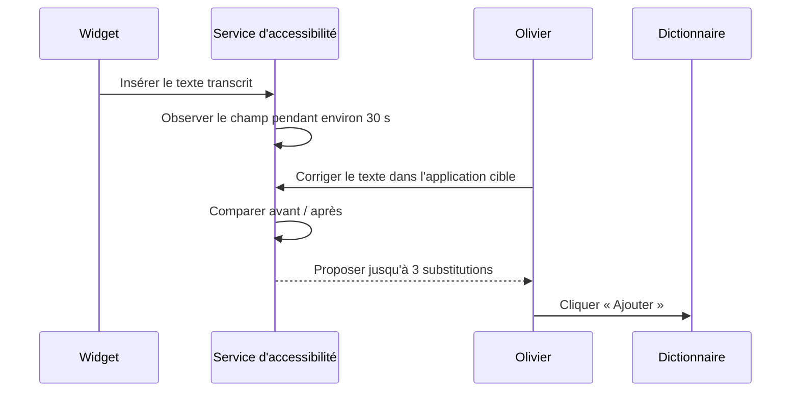

# Dictionnaire et apprentissage Android

> **Type** : explication technique et limites produit
> **Statut** : comportement observé et candidate durcie; le mot « apprentissage » est qualifié
> **Base auditée** : `main@552c4282595922f5a7f1eeb5c6140c4b24f9dfbf`
> **Candidate décrite** : tip de `codex/android-alpha`; vérifier son SHA à la reprise

## Résumé exact

Android fournit un **dictionnaire de substitutions avec suggestions assistées**. Il n'entraîne pas Whisper et n'apprend pas automatiquement toute la manière de parler d'Olivier.

Deux types d'entrées coexistent :

| `entendu` | `remplacer_par` | Effet réel |
|---|---|---|
| terme ou expression | vide | `entendu` est ajouté au prompt envoyé au relais distant; aucune substitution locale |
| forme mal reconnue | correction non vide | `remplacer_par` est ajouté au prompt distant et une substitution exacte est appliquée après toute transcription, locale ou distante |

Source : [`ChuchoteStore.kt`](../app/src/main/kotlin/dev/soupslurpr/transcribro/memory/ChuchoteStore.kt), projection `EntreeDictionnaire` et opérations du dictionnaire.

## Ajout manuel

L'écran Dictionnaire permet d'ajouter et supprimer des entrées. Le schéma et l'interface n'empêchent pas les doublons ni deux corrections divergentes pour la même forme entendue.

Références : [`DictionaryScreen.kt`](../app/src/main/kotlin/dev/soupslurpr/transcribro/ui/dictionary/DictionaryScreen.kt#L35-L139) et [`ChuchoteStore.kt`](../app/src/main/kotlin/dev/soupslurpr/transcribro/memory/ChuchoteStore.kt), fonction `ajouterEntree`.

## Substitution après transcription

Pour chaque entrée dont `remplacer_par` n'est pas vide, le store applique une regex Unicode insensible à la casse avec frontières de mot ou de phrase. Il peut préserver une majuscule initiale.

Référence : [`ChuchoteStore.kt`](../app/src/main/kotlin/dev/soupslurpr/transcribro/memory/ChuchoteStore.kt), fonction `appliquerCorrections`.

Cette étape se trouve dans le service central après un résultat local comme distant. Elle fonctionne donc avec les deux chemins. Références : [`MainRecognitionService.kt`](../app/src/main/kotlin/dev/soupslurpr/transcribro/recognitionservice/MainRecognitionService.kt#L347-L359) et [`MainRecognitionService.kt`](../app/src/main/kotlin/dev/soupslurpr/transcribro/recognitionservice/MainRecognitionService.kt#L422-L433).

### Limites déterministes

- Les corrections peuvent se chaîner si le résultat d'une entrée correspond à une suivante.
- L'ordre entre doublons n'est pas défini par une contrainte métier.
- Aucun contexte d'application, de langue ou de phrase n'est enregistré.
- Aucun score de confiance ne protège contre une mauvaise substitution acceptée.

## Biais de reconnaissance

`motsPourBiais()` construit un prompt à partir du dictionnaire, limité à 600 caractères. Il prend `entendu` lorsque le remplacement est vide et `remplacer_par` dans le cas contraire, puis retire les doublons exacts. Référence : [`ChuchoteStore.kt`](../app/src/main/kotlin/dev/soupslurpr/transcribro/memory/ChuchoteStore.kt), fonction `motsPourBiais`.

Ce prompt est utilisé uniquement dans [`RemoteTranscriber.kt`](../app/src/main/kotlin/dev/soupslurpr/transcribro/remote/RemoteTranscriber.kt#L67-L76). Le JNI Whisper local ne reçoit aucun `initial_prompt`.

Conséquence importante : le texte UI qui affirme qu'une entrée avec seulement un mot aide « la transcription » est trop général. Cette entrée peut influencer le fournisseur distant lorsque le relais fonctionne, mais elle n'influence pas Whisper local au snapshot audité.

## Proposition après correction de l'utilisateur

Le seul apprentissage assisté actuel suit ce parcours :

Références : [`TextInsertionAccessibilityService.kt`](../app/src/main/kotlin/dev/soupslurpr/transcribro/overlay/TextInsertionAccessibilityService.kt#L93-L185) et [`TextInsertionAccessibilityService.kt`](../app/src/main/kotlin/dev/soupslurpr/transcribro/overlay/TextInsertionAccessibilityService.kt#L194-L289).

La correction n'est jamais persistée automatiquement : une action explicite de l'utilisateur est requise. Dans la candidate, le service ne conserve qu'une fenêtre locale bornée autour du contenu réellement dicté; ses bornes excluent les espaces synthétiques ajoutés pour séparer les mots. Il purge cette fenêtre si la cible change ou devient un mot de passe, et cesse toute observation si le consentement courant est retiré. Le bouton « Ajouter » relit encore la préférence durable immédiatement avant l'écriture SQLite : une révocation survenue pendant l'affichage de la proposition ferme celle-ci sans ajout.

L'observation exige aussi une ancre de texte non vide à droite de l'insertion. À la fin exacte d'un champ, elle est volontairement désactivée : sans cette ancre, le texte tapé ensuite pourrait être interprété à tort comme une correction de la dictée. C'est une limite de sécurité de l'alpha, pas un apprentissage réussi.

## Algorithme de différence

[`CorrectionDiff.kt`](../app/src/main/kotlin/dev/soupslurpr/transcribro/memory/CorrectionDiff.kt#L3-L104) emploie une plus longue sous-séquence commune mot à mot. Il limite volontairement le bruit :

- maximum 400 mots analysés;
- maximum trois mots par remplacement candidat;
- maximum trois propositions;
- ajout ou suppression pur ignoré;
- réécriture longue ignorée;
- correction purement numérique ignorée;
- simple changement de majuscule initiale ignoré.

## Limite de couverture

Le seul appel observé à l'insertion surveillée vient du widget. Le clavier IME n'utilise pas cette méthode. Donc :

- correction après dictée par widget : peut produire une proposition;
- correction après dictée par clavier : ne produit pas de proposition;
- correction du texte depuis l'écran Historique : aucun mécanisme correspondant;
- historique : conserve le texte au moment de la dictée, pas la version que l'utilisateur corrige ensuite dans l'application cible.

## Initialisation asynchrone

Le dictionnaire est initialisé vide puis chargé de SQLite de façon asynchrone. Une toute première dictée lancée avant la fin du chargement pourrait ne pas recevoir les corrections ou le prompt attendus. C'est une inférence de code à reproduire avant de la classer comme bug.

Référence : [`ChuchoteStore.kt`](../app/src/main/kotlin/dev/soupslurpr/transcribro/memory/ChuchoteStore.kt), bloc d'initialisation et flows du store.

## Ce qui manque pour le but d'Olivier

- observation dans tous les parcours de dictée;
- rattachement de la correction faite plus tard dans l'application cible à la
  dictée durable correspondante. Le store v3 conserve déjà le résultat STT
  brut et le texte après substitutions du dictionnaire, mais pas cette édition
  externe ultérieure;
- fréquence, confiance et dates d'observation;
- confirmations et rejets explicites;
- expressions multi-mots évaluées sans substitution excessive;
- langue et contexte;
- déduplication et résolution des contradictions;
- synchronisation avec les mots personnalisés du desktop;
- moyen de désactiver ou annuler une correction apprise;
- corpus de test représentatif de la manière de parler d'Olivier.

La forme du futur vocabulaire commun reste une décision ouverte dans
[OPEN_DECISIONS.md](https://github.com/ReiiViilo/Chuchote-Flow/blob/ab0479f136bc3f6fc0d9dffc22ffa08a58fd4552/.docs/OPEN_DECISIONS.md).
